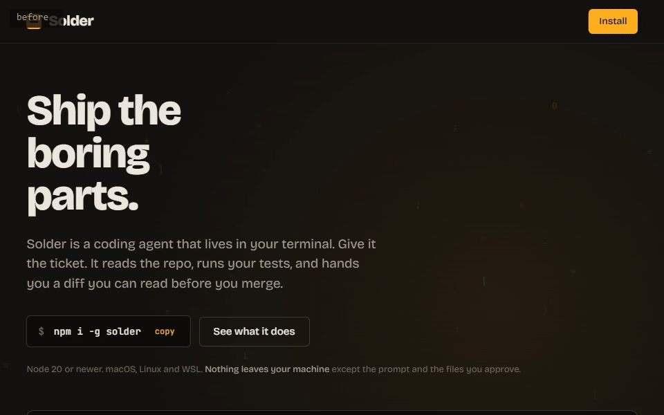

# unflat

**Your AI-built site is flat. Unflat it.**

One CSS block that gives a single-tone page a ground, one light source, a few mounted surfaces and a little of its own atmosphere, derived from the site's own colors, shapes and subject. No markup changes. Delete the block to revert.

  



```bash
npx skills add merturl4576/unflat
```

Then tell your agent: *"This page looks flat. Use the unflat skill."*

## The problem

AI-generated pages put everything on one plane. One background color, sections stacked on it, cards floating with nothing under them. No ground, no light, no material. The page reads as a mockup.

## What unflat does

It is an [Agent Skill](https://agentskills.io) for Claude Code, Cursor, Codex and other coding agents. The agent audits the page, extracts your tokens, picks a material from your site's world, decides which sections are mounted and which rest on the ground, reads the site's subject for a motif and its palette for two washes, and appends one block to your global stylesheet. Nine moves:

1. **Ground and lift.** The page background moves 1–3% lightness down and the sections lift 2–3% up — a separation of about 4–6% (never more than 6%). On dark themes the ground is tinted toward your accent when their hues differ.
2. **Light.** One fixed layer: a directional light and a vignette. Everything agrees on where the light comes from.
3. **Texture.** Inline SVG grain tinted to your palette, 3–6% opacity. No image files.
4. **Rhythm.** Not every section. The hero, strips and sections with their own artwork stay on the ground; the sections a visitor reads alternate with them as surfaces, a third to a half of the page. Every section boxed is not depth.
5. **Surfaces.** The mounted sections: inset, your own corner radius, lit top edge, deep shadow, a hairline of light, breathing room against the ground. A store, article or product page is one surface, the page plate.
6. **Alignment.** Content stays on your grid; header and footer stay on the ground.
7. **Fields.** Two soft washes behind two sections: your accent in one, its temperature counterpart in the other.
8. **Motif.** One faint geometric echo of what the site is about: rings for a camera, a fading grid for a workshop, one arc for a journal, nothing for a bank.
9. **Cards and motion.** Your cards read as a second level on the surfaces, and lift on hover. That is the only thing that moves.

## Install

```bash
npx skills add merturl4576/unflat
```

Claude Code, manual:

```bash
git clone https://github.com/merturl4576/unflat
cp -r unflat/skills/unflat ~/.claude/skills/unflat      # or <project>/.claude/skills/unflat
```

Any agent that reads `SKILL.md` folders works the same way.

## Use

Say one of these to your agent:

- "This landing page looks flat. Use the unflat skill."
- "Unflat `app/globals.css`. Keep the header as it is."
- "Add depth to this site without changing the HTML."

The agent replies with an audit, a token table, the material it picked and why, which sections it mounted and which it left on the ground, the taste it read from your site, the values it derived, and a nine-line report with the revert instruction.

## Materials

| Material | Theme | Picks itself for | Physics |
|---|---|---|---|
| plate | dark | workshops, industrial, craft, hardware, gaming | warm top-left light, lit edge, deep shadow, grain |
| paper | light | editorial, blogs, docs, portfolios | sheets on a darker desk, soft tinted shadow |
| glass | dark, cool | SaaS, AI, developer tools | soft accent field, semi-transparent panels, inner highlight |
| slate | any, neutral | enterprise, legal, B2B, government | cold light, planes close together, hairlines, no glow |
| backlit | dark, saturated | brands, music, events, streetwear | lit from behind by the accent, glowing edges |

Neutral fallbacks: plate for dark, paper for light. Glass is never a default.

## Guardrails

- Surfaces stay within 3% lightness of your section background, so text contrast does not change.
- The hero, strips and artwork sections stay on the ground; a third to a half of the sections are mounted, never all of them.
- Header, footer, fixed and sticky elements are never touched.
- The only motion is a 3px lift on hover for cards inside surfaces, and only for pointers that can hover; nothing on load, nothing on scroll, nothing on touch screens. No `filter`, no `backdrop-filter` by default.
- Two fixed pseudo-elements at most (light, motif), one SVG data URI. No requests, no assets.
- `@media print` strips ground, texture and shadows.
- Everything sits between `/* unflat: start */` and `/* unflat: end */`. Delete it and the site is exactly what it was.
- Every `after.html` in `examples/` is `before.html` plus the block and nothing else; `node scripts/check-examples.mjs` proves it. The after pages were produced by the skill itself, not by hand, and `docs/dogfood.md` keeps the log. Open any pair in a browser to compare.

## FAQ

**Does it work with Tailwind?** Yes. The block is plain unlayered CSS appended after the Tailwind import, so it wins over layered utilities. Class names are never used; sections are targeted by structure and `:has()`.

**Why are some sections still on the plain background?** That is the point. A surface reads as a surface only with ground next to it, so the hero, strips and sections with their own artwork stay on the ground and the sections you read are mounted between them. Ask the agent to move a section either way; the alternation is the thing to keep.

**Where does the "taste" come from?** From the site, not from a palette of ours. The washes are your accent and its temperature opposite at a few percent; the motif is one shape the subject hands over (rings for optics, a grid for a workshop, an arc for a journal), drawn once so faintly it reads on the second look; the radius is your card radius. Each is a dial in the block, and each rule is deleted when the site gives it nothing.

**Does it change my HTML?** No. If a page's structure truly cannot express the choice, the skill may add a `data-unflat` attribute and will say so in its report.

**Light themes?** Yes. Paper and light slate use ink-tinted shadows, slightly lighter sheets and a soft white edge instead of a lit metal edge.

**Dashboards?** No. unflat is for marketing and content pages. The skill stops and says so on app UI.

**Performance?** One `position: fixed` pseudo-element with gradients and an inline SVG. Nothing runs on scroll.

**It picked the wrong material.** Tell the agent which one you want; the decision table in `skills/unflat/references/materials.md` is a default, not a rule.

## Why

Sites built by an agent tend to share one tell: every section sits on the same solid color. Nothing is in front of or behind anything, so the page reads as unfinished even when the layout is right. More components do not fix that. A ground, one light source and surfaces mounted on that ground do, and all three can be derived from the palette the site already has. unflat is that fix as a single appended CSS block.

## Contributing

New materials are welcome. A material is a table of `--unflat-*` values, a domain list for the decision table and an override snippet; see the end of `skills/unflat/references/materials.md`. Add a demo pair under `examples/` and run `node scripts/check-examples.mjs`.

If unflat made a page of yours look built, a star helps the next person find it.

## License

MIT.

---

### Türkçe özet

unflat, tek ton bir zemine oturmuş web sitelerine zemin, tek bir ışık kaynağı ve monte yüzeyler kazandıran bir Agent Skill'dir. Renkler sitenin kendi token'larından türetilir, HTML'e dokunulmaz, tek bir CSS bloğu eklenir; bloğu silince site eski haline döner. Kurulum: `npx skills add merturl4576/unflat`. Beş malzeme: plate, paper, glass, slate, backlit.
